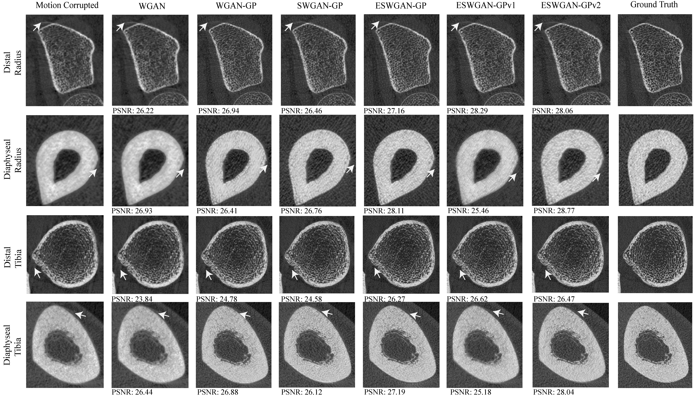

# Simulating Sinogram-Domain Motion and Correcting Image-Domain Artifacts in HR-pQCT Bone Imaging

- This repository provides the official implementation of the paper "Simulating Sinogram-Domain Motion and Correcting Image-Domain Artifacts in HR-pQCT Bone Imaging". It includes a motion simulation tool to generate motion artifacts from ground-truth images. The repository also contains the training and testing code for the motion artifact correction framework ESWGAN-GP in HR-pQCT scans.

- URL: https://ieeexplore.ieee.org/document/11192748

## Repository Structure

- **`Motion Simulation/`**  
  Scripts and utilities for simulating realistic motion in HR-pQCT images, including sinogram-domain manipulations.

- **`ESWGAN-GP/`**  
  Deep learning-based motion artifact correction in the image domain. Includes model definitions, training scripts, and evaluation utilities.

## Features

- Generate motion-corrupted HR-pQCT images from ground-truth scans.  
- Train neural networks to compensate for motion artifacts.  
- Evaluate performance using quantitative metrics and visualizations.

## Edge-enhanced Self-attention Wasserstein Generative Adversarial Network with Gradient-Penalty

### Motion Correction Performance

## Usage

1. **Motion Simulation**  
   Run scripts in `Motion Simulation/` to generate motion-corrupted images.

2. **Motion Correction**  
   Train or use pre-trained models in `ESWGAN-GP/` to correct artifacts in HR-pQCT images.

## Citation

If you use this code, please cite:

- F. Sadik, C. L. Newman, S. J. Warden and R. K. Surowiec, "Simulating Sinogram-Domain Motion and Correcting Image-Domain Artifacts Using Deep Learning in HR-pQCT Bone Imaging," in IEEE Transactions on Radiation and Plasma Medical Sciences,
doi: 10.1109/TRPMS.2025.3617225. keywords: {Motion artifacts;Bones;Imaging;Image reconstruction;Computed tomography;Translation;Generative adversarial networks;Signal to noise ratio;Mathematical models;
Training;Bone;HR-pQCT;Motion;Sinogram;ESWGAN-GP;SNR;SSIM;VIF;Deep Learning}

## BibTex
- @ARTICLE{11192748,
  author={Sadik, Farhan and Newman, Christopher L. and Warden, Stuart J. and Surowiec, Rachel K.},
  journal={IEEE Transactions on Radiation and Plasma Medical Sciences}, 
  title={Simulating Sinogram-Domain Motion and Correcting Image-Domain Artifacts Using Deep Learning in HR-pQCT Bone Imaging}, 
  year={2025},
  volume={},
  number={},
  pages={1-1},
  keywords={Motion artifacts;Bones;Imaging;Image reconstruction;Computed tomography;Translation;Generative adversarial networks;Signal to noise ratio;Mathematical models;Training;Bone;HR-pQCT;Motion;Sinogram;ESWGAN-GP;SNR;SSIM;VIF;Deep Learning},
  doi={10.1109/TRPMS.2025.3617225}}

## Contact

- Farhan Sadik, fsadik@purdue.edu

